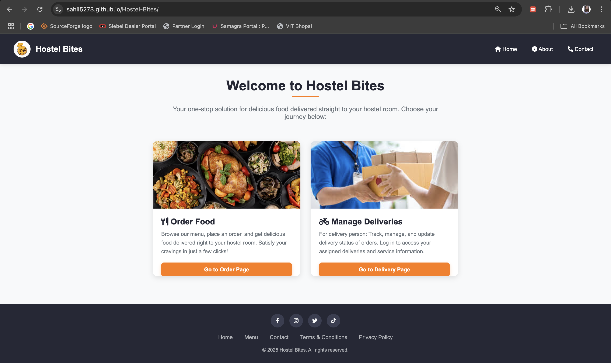
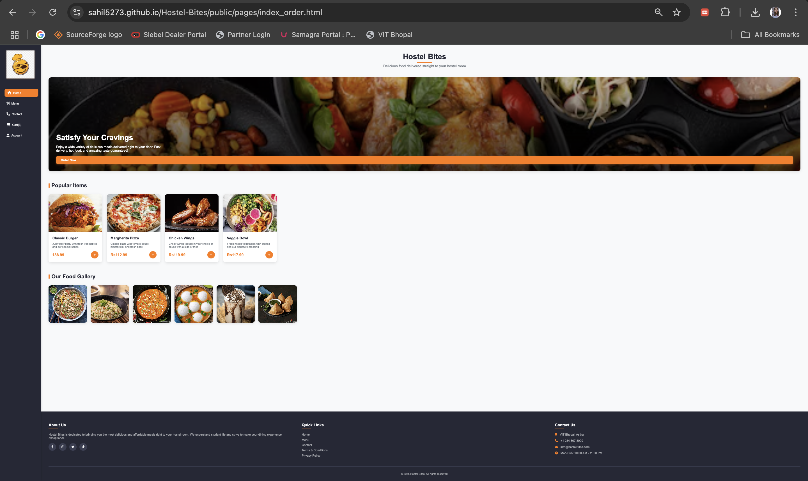
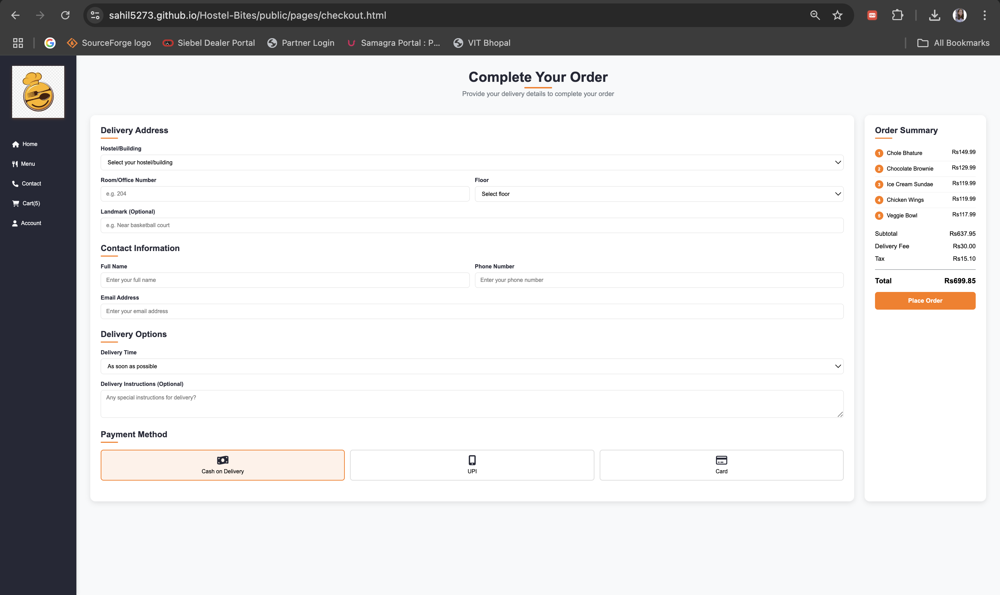
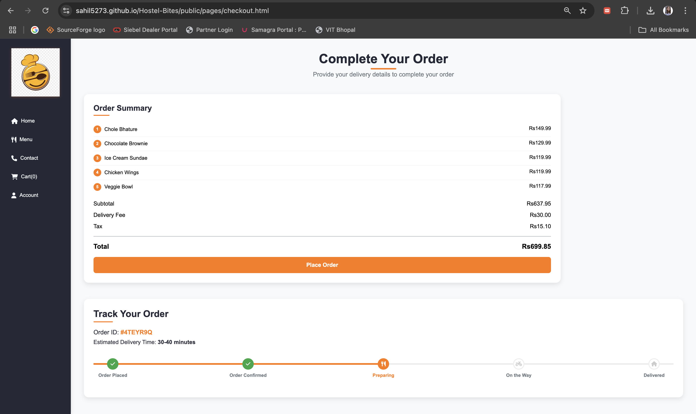

# Hostel Bites – Smart Hostel Food Ordering Web App

[](LICENSE)

[](https://sahil5273.github.io/Hostel-Bites/)

Hostel Bites is a modern, responsive web application designed for hostel students to conveniently browse menus, add items to their cart, and place food orders with live order tracking. Built using HTML, CSS, and JavaScript, it delivers a seamless and intuitive user experience across devices.

---


## Live Demo

[View the Live Demo](https://sahil5273.github.io/Hostel-Bites/)

---

## Features

- **Responsive Design:** Works smoothly on desktops, tablets, and mobile devices.
- **Categorized Menu:** Browse food items by category for easy selection.
- **Cart Functionality:** Add, remove, and update item quantities in your cart.
- **Checkout & Order Tracking:** Place orders and track their status in real time.
- **Modern UI:** Clean, user-friendly interface with intuitive navigation.
- **No Backend Required:** All features run client-side using local storage.


## Screenshots

<p align="center">
	
	<br><em>Homepage: Clean landing page with navigation and branding</em>
	<br><br>
	
	<br><em>Menu Page: Categorized food items with images and add-to-cart buttons</em>
	<br><br>
	
	<br><em>Cart Page: Selected items, quantity controls, and checkout summary</em>
	<br><br>
	
	<br><em>Checkout & Order Tracking: Order summary, delivery options, and real-time tracking</em>
	<br><br>
	
	<br><em>Order Placed: Confirmation screen after successful order placement</em>
</p>
---

## Group Members

- Diksha Damahe
- Sahil Kumar
- Sneha Mandal
- Anushka Yadav
- Vishal Sharma
- Vidit Kumar

---

## Getting Started

1. **Clone the repository:**
	```sh
	git clone https://github.com/<your-username>/<your-repo>.git
	```
2. **Open the project folder:**
	- You can open `index.html` directly in your browser, or use a local server for best results.
3. **Customize:**
	- Update menu items, images, and branding as needed in the HTML files and `Pictures/` folder.

---

## Project Structure

```
hostel-bites/
│
├── index.html         # Home page
├── menu.html          # Menu with categories
├── cart_index.html    # Shopping cart
├── checkout.html      # Checkout and order tracking
├── contact.html       # Contact form
├── script.js          # Main JavaScript logic
├── Pictures/          # Images and assets
└── README.md          # Project documentation
```

---

## Customization

- **Menu Items:** Edit `menu.html` to add or update food items and categories.
- **Images:** Place your food images in the `Pictures/` directory and update image paths in HTML.
- **Branding:** Replace the logo and update color schemes in the HTML/CSS as desired.

---

## License

This project is licensed under the [MIT License](LICENSE).

